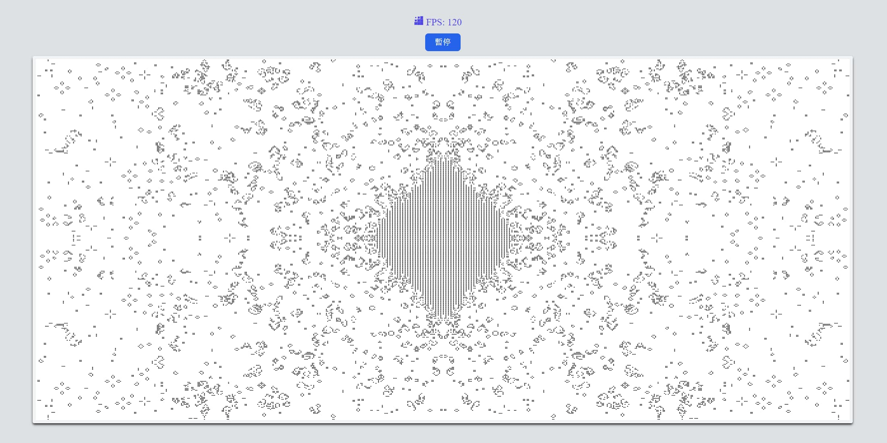

# Game of Life

[Page](https://zhen-wei.github.io/game-of-life/)

## Introduction

The project is based on the official introductory tutorial [wasm-game-of-life](https://rustwasm.github.io/docs/book/introduction.html) from Rust WebAssembly, with modifications.

The demo runs WebAssembly (wasm) in a web worker and performs off-screen rendering to prevent blocking the main thread.



## Features

- Utilizes WebAssembly and offscreen rendering in a worker for improved performance.
- Implements WebGL rendering using [pixi.js](https://pixijs.com/).
- Try using [unocss](https://unocss.dev/) for styling in small exercises.


## Getting Started

To build the WebAssembly module, use the following command:

```bash
wasm-pack build --target web --reference-types --weak-refs
```

Next, navigate to the web directory, install dependencies, and run the demo:

```bash
cd web
pnpm install
pnpm run dev
```

This will launch the demo on http://localhost:5174/.

Note: Ensure that you have Node.js and pnpm installed on your machine.

## Environment Requirements

Ensure that your browser supports OffscreenCanvas, WebGL, and wasm simd. The following browser versions are recommended:

- Chrome: >= 91
- Safari: >= 17
- Firefox: >= 105

> Can I use: https://caniuse.com/offscreencanvas
> 
> webassembly roadmap: https://webassembly.org/roadmap/

## Known Issues

- In Firefox, pixi.js may encounter a `WebGL context is lost` issue, resulting in slow rendering.
  - Issue tracking: https://github.com/pixijs/pixijs/issues/6494
- The behavior of `transferFromImageBitmap` is inconsistent across different browsers, leading to varying results. A temporary solution is to use `drawImage` to address this issue.
  - Issue tracking: https://github.com/whatwg/html/issues/7833
